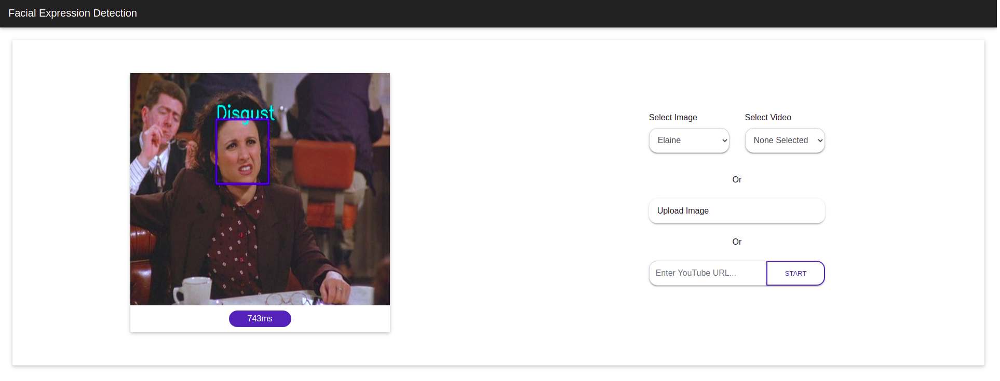

# Facial Expression Recognition App

This is a sentiment analysis tool to detect the six basic expressions: happiness, sadness, anger, surprise, fear, and disgust. Such an application can be used in Market Research, for example, to observe user's reaction while interacting with a brand or a product.

There are many ways a user can use this app for emotion recognition:  
* **Preloaded Images and Videos**: User can select an image or a video from a number of choices in a dropdown. These are NOT already annotated, but will only be annotated after a user selects them.  
* **Upload Image**: User can also upload their image and it will be annotated with the facial expression in less than a second.  
* **Enter YouTube URL**: A user can also enter a YouTube URL, and each frame that contains one or more humans will be annotated. The URL has to be a valid YouTube URL.

#### Future Scope: 
Webcam feed will be added to the mix. Also, there's room for improvement on the model itself.

## How do I get set up?

#### Easiest Way -> Docker

From the project root, run:  
`sudo bash start.sh`

The app should be running at http://127.0.0.1:5000

#### Run without Docker

Create a virualenv:  
`conda create -n myenv python=3.6`

Activate:  
`conda activate myenv`

Install Requirements:  
`pip install -r requirements.txt`

Run:  
`python main.py`
